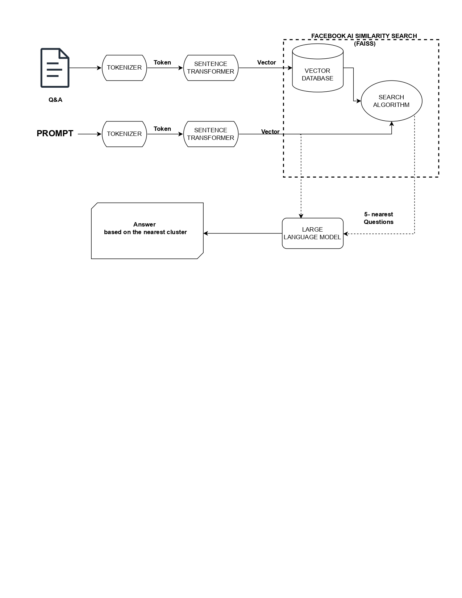

# Fintech for Inclusion: Retrieval-Augmented Generation (RAG) System for Financial Query Response

This project focuses on designing and implementing a **Retrieval-Augmented Generation (RAG)** system aimed at identifying and ranking the top 5 most relevant financial queries from a dataset. The goal is to enhance user interaction by integrating an effective retrieval process with advanced language models for answering financial-related questions. It utilizes **LlamaIndex** for optimized data retrieval and **Gemini pipelines** for efficient conversational flows, providing seamless voice-based input and output for improved accessibility.

## Key Features

- **Retrieval-Augmented Generation (RAG) System**: Combines powerful retrieval techniques with a generative model to enhance the accuracy of responses to financial queries.
- **Faiss Integration**: Utilizes **Faiss** for fast and efficient similarity search, providing real-time retrieval of relevant financial FAQs.
- **LlamaIndex**: Used for optimizing the retrieval process and enhancing conversational AI capabilities.
- **Gemini Pipelines**: Integrates with Gemini pipelines to streamline conversational flows and offer a smoother user experience.
- **Voice-Based Accessibility**: Ensures improved user interaction by supporting voice-based input and output.

## Technologies Used

- **Hugging Face Transformers**: Leverages the **Meta-Llama-3-8B-Instruct** model for question answering and document embedding.
- **Faiss**: High-performance similarity search library for fast retrieval.
- **PyTorch**: Deep learning framework used for model inference, with support for mixed precision to optimize GPU usage.
- **Pandas**: For processing and loading FAQ datasets.
- **NumPy**: For efficient numerical operations.

  # Financial Bot Overview




## Prerequisites

Before running the code, ensure that the following prerequisites are met:

- Python 3.8 or higher
- A GPU-enabled system with CUDA installed (optional but recommended)
- A valid Hugging Face access token for accessing the **Meta-Llama-3-8B-Instruct** model

  ## Installation

1. Clone the repository:

   ```bash
   git clone https://github.com/your-repo/fintech-rag-system.git
   cd fintech-rag-system

2. Create and Activate a Virtual Environment:
   
    ```bash
    python -m venv env
    source env/bin/activate  # On Windows: .\\env\\Scripts\\activate
    pip install -r requirements.txt

# Code Overview

### Data Loading
The project loads financial FAQ data from a CSV file using Pandas.

### Embedding Generation
Text data is tokenized and passed through a pre-trained Meta-Llama model to generate embeddings for each FAQ.

### Faiss Index
The generated embeddings are stored in a Faiss Index, enabling fast nearest-neighbor searches for retrieving relevant responses based on user queries.

### Querying
When a query is provided, it is tokenized, embedded, and compared against the FAQ embeddings using Faiss to return the top 5 most relevant responses.

### Batch Processing and Mixed Precision
The embedding generation is optimized for GPU usage with `autocast` and `GradScaler` for mixed precision to improve performance.

---

# Example Query

To use the system, simply provide a query, and the top 5 most relevant questions and answers will be returned:

```python
query = "What is tax evasion?"
responses = get_top_faq_responses_faiss(query)
for i, response in enumerate(responses, 1):
    print(f"Q{i}: {response['question']}\\nA{i}: {response['answer']}\\n")


  


